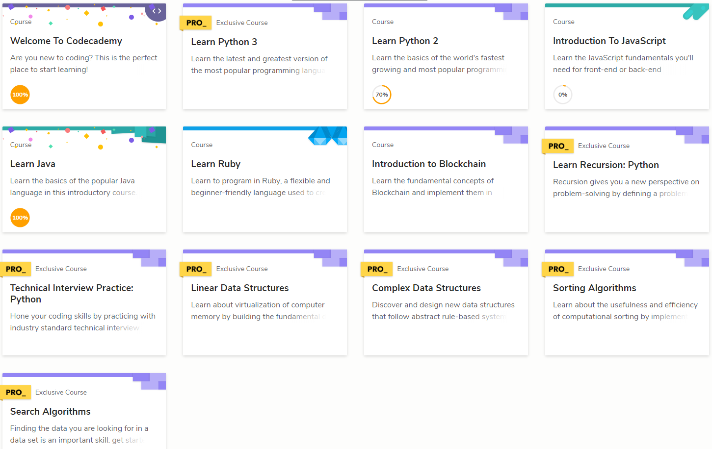
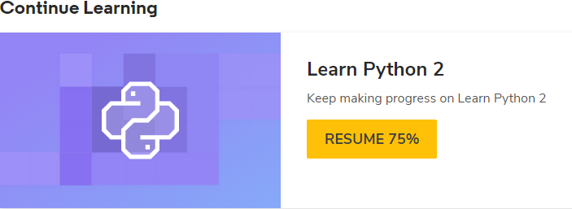
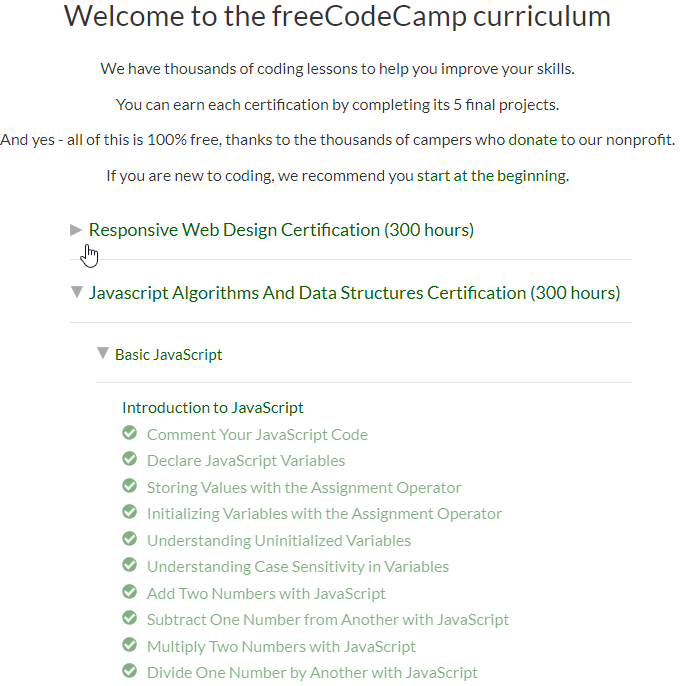

# 100 Days Of Code - Log

### Day 0: November 27, 2018

**Today's Progress**: Setting up this GitHub log.

**Thoughts:** Excited to start back coding after three years of on and off coding. I think to begin I will pick back up where I left off a few months ago on the Codecademy programming course list.

**Link to work:**

### Day 1: November 28, 2018

**Today's Progress**: Started back on Codecademy programming course list. Completed another 5% of the Python 2 course, looking to complete it by this weekend.
I also started JavaScript on FreeCodeCamp, only completed 10 lessons as I am short on time today. Hoping to make more of a dent and begin the codecademy and SoloLearn courses over JavaScript once I am through my first pass of Python 2.

**Thoughts:** I will for sure need to go back through the Python 2 course to get a refresher and to really work on some areas I struggled on. Just want to finish one run through before I reset my course status, thinking this will be better for me to really hammer in the concepts of the entire course. 

**Link to work:**

**Python work - + 5% progress**

**JavaScript work, set up FreeCodeCamp profile and ran through 10 lessons to see the format**

### Day 1: January 11, 2019

**Today's Progress**: Finished up SoloLearn's CSS fundamentals course along with CodeCademey's HTML course.

**Thoughts:** Kinda dropped the ball on keeping this going with EOY and tax projects going on at work, but I am back and with vengence! Since getting back into this challenge since the first of the year I have completed the SoloLearn JavaScript, HTML, and CSS courses along with the Codecademy HTML course. My current plan is to finish up CSS, JavaScript (Asynchronous, ReactJS I-II, and JQuery), finish the SoloLearn JQuery and PHP course. At some point I will begin on developing a Website to begin my post college portfolio, and will share that journey here. So stay tuned and we'll see what this turns into. Happy new year, now go get after it!

**Link to work:**
